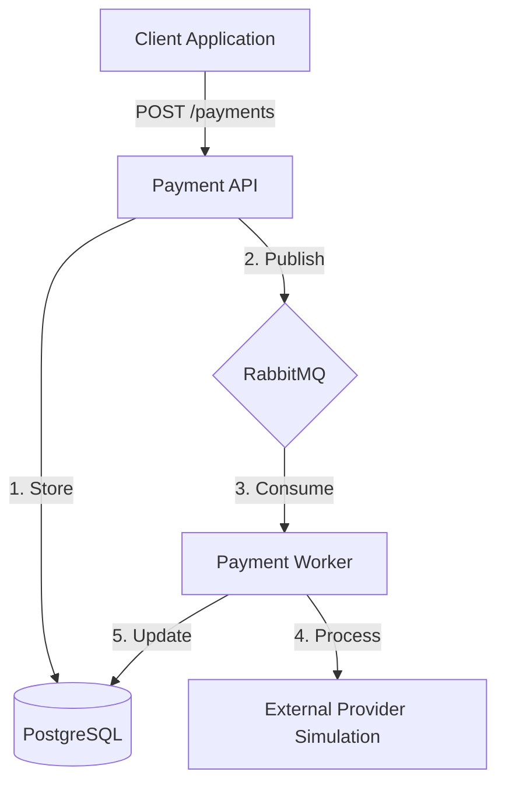

# Distributed Payment Processing System

A high-performance, event-driven payment gateway demonstration built with **.NET 8**, **RabbitMQ**, and **PostgreSQL**. This system implements industry-standard patterns for reliable financial transaction processing, ensuring data integrity and resilient performance.

## 🚀 Key Technical Features

### 🛡️ Strict Idempotency
Guarantees that retry attempts do not result in duplicate charges. The system uses an `Idempotency-Key` header to track and cache original responses, ensuring "exactly-once" processing semantics even under network instability.

### 📡 Event-Driven Architecture
Decouples payment submission from processing using **RabbitMQ**. The API accepts requests and emits `PaymentRequested` events, which are consumed by background workers for asynchronous execution.

### 🔄 Resilience & Reliability
- **Transactional Outbox Pattern**: Ensures that database updates and event publishing are atomic.
- **Exponential Backoff**: Automatic retry logic for transient failures with increasing delays.
- **Dead Letter Queues (DLQ)**: Failed transactions are moved to a dedicated queue for manual inspection after exhausting retry limits.

### 📊 Observability
Full visibility into system health via integrated **Prometheus** metrics and **Grafana** dashboards, covering traffic volume, latency, and success rates.

---

## 🏗️ Architecture



---

## 🛠️ Tech Stack

- **Framework**: .NET 8 (Web API & Background Workers)
- **Database**: PostgreSQL with Entity Framework Core
- **Messaging**: RabbitMQ via MassTransit
- **Messaging Patterns**: Transactional Outbox, Idempotency, Retry Policy
- **Containerization**: Docker & Docker Compose
- **Observability**: Serilog, Prometheus, Grafana

---

## 🚦 Getting Started

### Prerequisites
- [Docker Desktop](https://www.docker.com/products/docker-desktop/) or Docker Engine
- .NET 8 SDK (for local development)

### Quick Start
1. Clone the repository.
2. Run the entire stack using Docker Compose:
   ```bash
   docker-compose up -d
   ```
3. The API will be available at `http://localhost:5000`.

---

## 📁 Project Structure

- `api/`: .NET Web API for payment submission and status tracking.
- `workers/`: Background services for event processing and retry management.
- `shared/`: Shared models, event definitions, and utility constants.
- `infrastructure/`: Database context, migrations, and shared service implementations.
- `docker/`: Dockerfiles and infrastructure configuration (Prometheus, etc.).
- `docs/`: Detailed design documentation and system specifications.

---

## 📖 Documentation

For more detailed information, please refer to the following:
- [System Design](file:///home/karabooliphant/Projects/DP-Processing-System/docs/SYSTEM_DESIGN.md)
- [API Specification](file:///home/karabooliphant/Projects/DP-Processing-System/api/DP.Api.http)